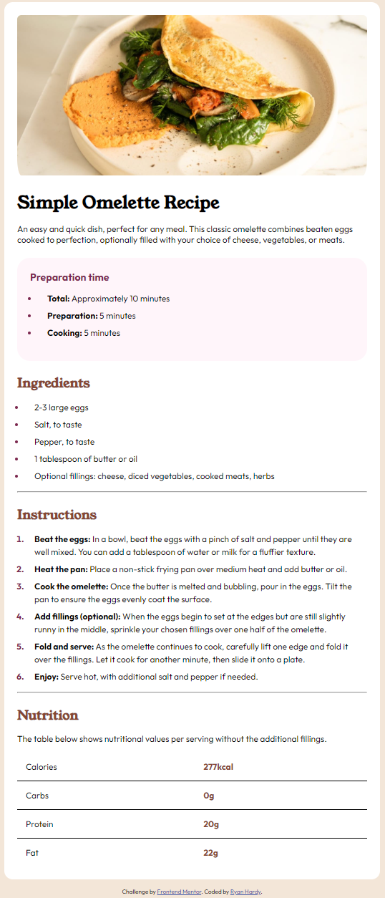

# Frontend Mentor - Recipe page solution

This is a solution to the [Recipe page challenge on Frontend Mentor](https://www.frontendmentor.io/challenges/recipe-page-KiTsR8QQKm). Frontend Mentor challenges help you improve your coding skills by building realistic projects. 

## Table of contents

- [Frontend Mentor - Recipe page solution](#frontend-mentor---recipe-page-solution)
    - [Table of contents](#table-of-contents)
    - [Overview](#overview)
        - [Screenshot](#screenshot)
        - [Links](#links)
    - [My process](#my-process)
        - [Built with](#built-with)
        - [What I learned](#what-i-learned)
        - [Continued development](#continued-development)
        - [Useful resources](#useful-resources)

## Overview

### Screenshot



### Links

- Solution URL: [Add solution URL here](https://your-solution-url.com)
- Live Site URL: [Add live site URL here](https://your-live-site-url.com)

## My process

### Built with

- Semantic HTML5 markup
- CSS
- Mobile-first workflow

### What I learned

This is a more complex layout, so it was definitely a challenge. I had to look into
concepts I haven't used so far in these challenges. I used a media query because the
design guide showed that the image should have no padding on mobile. I also had to
quickly learn how to style tables. I had trouble getting the table lines to match
the design until I came up with this:

```css
.nutrition table tr:last-child {
  border-bottom: 0;
}
```
I am also happy with how I organized the HTML by splitting it into sections. I didn't
do much else in terms of accessibility (no :focus styling, and I also skipped out
on the figure element).

### Continued development

I definitely think the CSS is messy. I feel like once I do more of these and get used to
how the cascade works, I may come back and reorganize it.

### Useful resources

- [W3Schools' Tables Explanation](https://www.w3schools.com/css/css_table.asp) - I've always liked W3Schools because their explanations are very concise. At first, I felt like learning tables would
be time consuming, but this made it go much faster. I also used the site to figure out styling for the tables.
